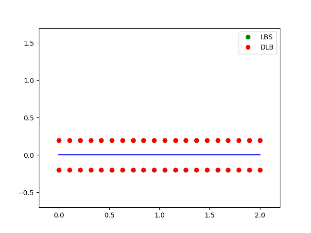
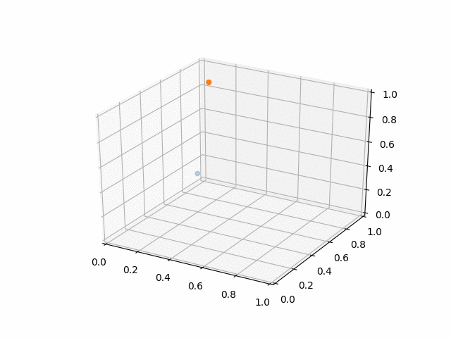

# dq3d

Dual quaternion for 3d geometric operations.

## examples

### Skinning
This example is a demonstration of skinning with Dual quaternion Linear Blending.

### Sclerp
This example is a demonstration that interpolates between two randomly generated dual quaternions with ScLerp.

## References
* [Skinning with Dual Quaternions](https://www.cs.utah.edu/~ladislav/dq/index.html)